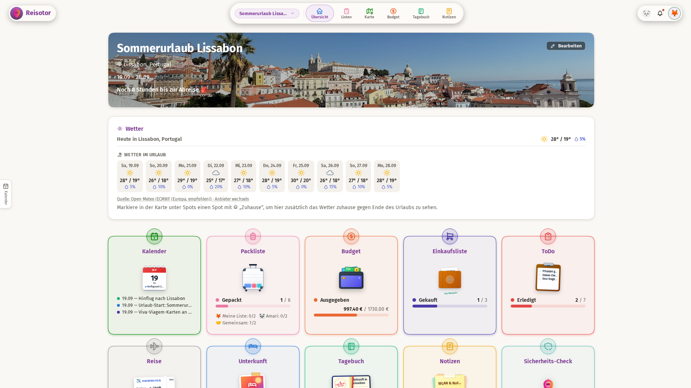
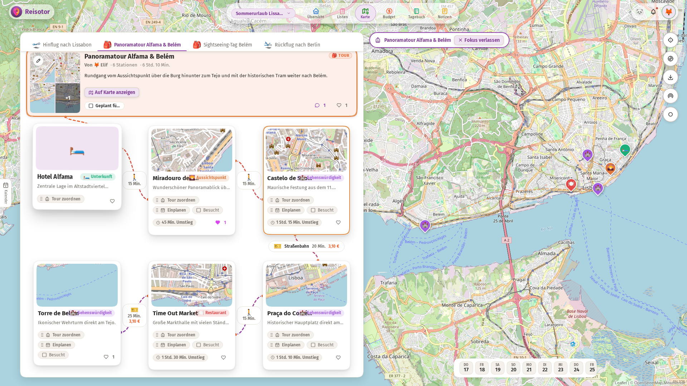
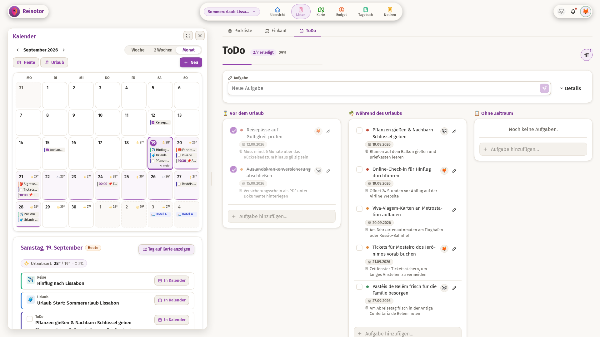
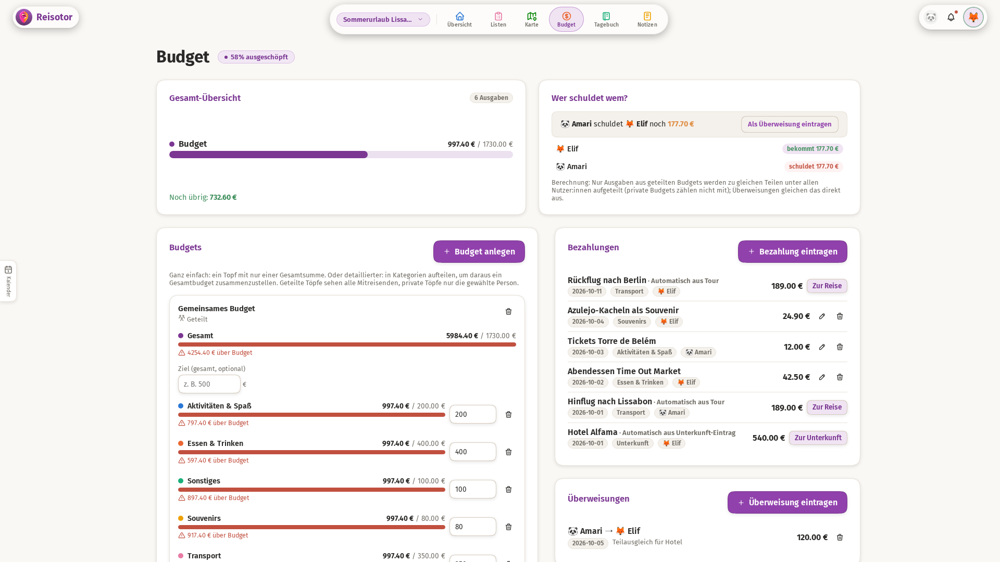
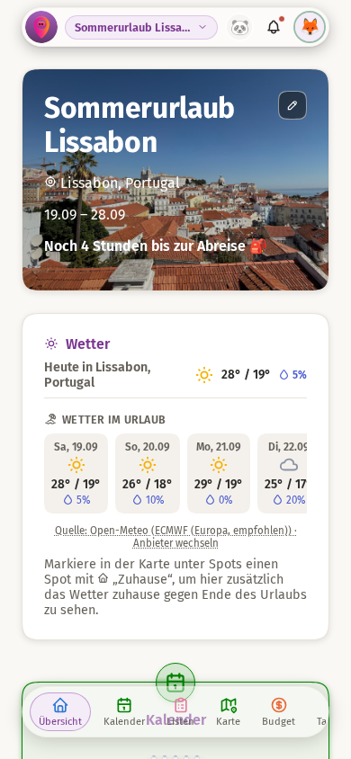
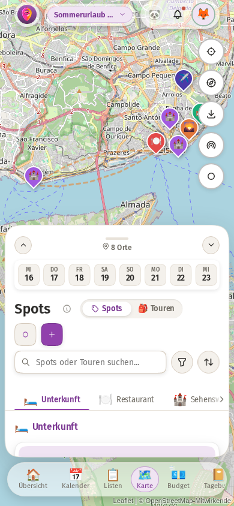
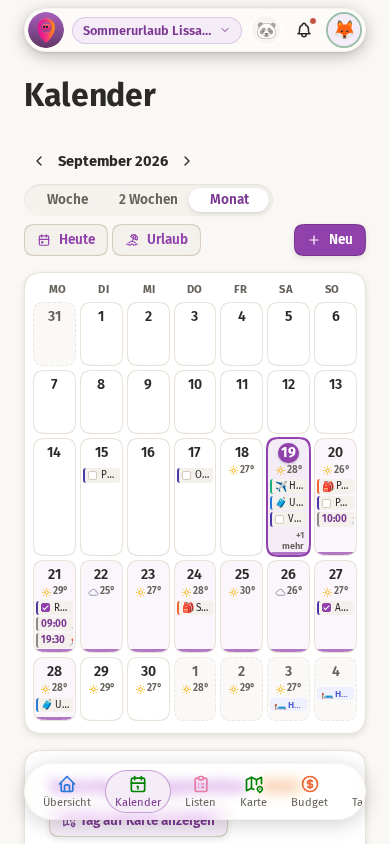

<p align="center">
  
</p>

# 🎒🤖 Reisotor

Web-App zur gemeinsamen Reiseplanung – ein zentraler Ort für alles rund um Deine Reise.

[🌍👉 Demo 👈🎒](https://dmstern.github.io/reisotor/)

<p align="center">
  <picture>
    <source media="(prefers-color-scheme: dark)" srcset="./docs/screenshots/dashboard-desktop-dark.png">
    
  </picture>
</p>

## 📸 Eindrücke

<details open>
<summary><b>🗺️ Spots, Touren & Entdeckungen auf der Karte</b></summary>
<br />

<p align="center">
  <picture>
    <source media="(prefers-color-scheme: dark)" srcset="./docs/screenshots/spots-desktop-dark.png">
    
  </picture>
</p>

<p align="center">
  <picture>
    <source media="(prefers-color-scheme: dark)" srcset="./docs/screenshots/tour-desktop-dark.png">
    
  </picture>
</p>
</details>

<details>
<summary><b>📅 Kalender, Zeitplan & Tagesablauf</b></summary>
<br />

<p align="center">
  <picture>
    <source media="(prefers-color-scheme: dark)" srcset="./docs/screenshots/calendar-desktop-dark.png">
    
  </picture>
</p>
</details>

<details>
<summary><b>💶 Gemeinsames Budget & transparente Abrechnung</b></summary>
<br />

<p align="center">
  <picture>
    <source media="(prefers-color-scheme: dark)" srcset="./docs/screenshots/budget-desktop-dark.png">
    
  </picture>
</p>
</details>

<details>
<summary><b>📱 Unterwegs auf dem Smartphone (Responsive & Offline-PWA)</b></summary>
<br />

<p align="center">
  
  
  
</p>
</details>

## Features

- 🏠 **Übersicht/Dashboard**: Intuitiver Schnellüberblick mit Reise-Countdown, anstehenden Terminen, Packlisten- und Budgetstatus sowie Live-Wetter
- 🗺️ **Spots & interaktive Karte**: Spots (Sehenswürdigkeiten, Unterkünfte, Gastronomie) mit Geokoordinaten, Adressen, Google-Maps-Verknüpfung, Likes, Kommentaren, Besuchsstatus und interaktiver Leaflet/OpenStreetMap-Karte mit Emoji-Markern
- 🥾 **Touren & Teilstrecken**: Mehretappen-Touren mit Stationen, Teilstrecken (Verkehrsmittel, Fahr- & Umsteigezeiten, Sitzplätze, Ticketkosten), geschwungenen Serpentinen-Routen und Live-GPS-Track-Aufzeichnung direkt im Browser
- 📅 **Ablauf & Kalender**: Floating-Drawer auf Desktop und eigenständige Mobil-Ansicht; Wochenablauf, Termine, Fälligkeiten und Drag & Drop von Ausflügen
- 🌦️ **Wetter & Unwetterwarnungen**: 14-Tage-Wettervorhersage, stündlicher Tagesverlauf, wählbare Wettermodelle (z. B. DWD ICON) und automatische Warnhinweise bei Hitze, Sturm oder Starkregen
- 📋 **Zentrale Listen (Packliste, Einkauf, ToDos)**: Zusammengefasste Listen-Ansicht (`/listen`) mit Rollen, Fälligkeiten, Prioritäten und Zuweisungen
- 💶 **Gemeinsames Budget**: Ziel- und Kategorienbudgets, Ausgaben, Überweisungen und automatischer Schuldenausgleich (Splitwise-artig)
- 📔 **Tagebuch**: Reiseberichte mit Bildern, Reaktionen und Kommentaren
- 📝 **Notizen & Dateianhänge**: Rich-Text-Notizen (fett/kursiv/Listen/Links) und universeller Datei-Upload für Buchungsbestätigungen und Tickets
- 🌍 **Reiseregion-Infos**: Landessprache, lokale Währung inklusive tagesaktueller Wechselkurse zur Heimatwährung sowie Sicherheitshinweise
- 📍 **Live-Standort & Präsenz**: Optionale Live-Standortfreigabe für Mitreisende direkt auf der Karte sowie Online-Präsenz-Avatare im Header
- ⚡ **Echtzeit-Synchronisation**: SSE-basierter Live-Sync zwischen allen Mitgliedern – Änderungen erscheinen sofort ohne Neuladen
- 📴 **Offline-fähige PWA**: Vollständig als App installierbar (iOS/Android/Desktop), lokaler Cache und automatische Nachsynchronisation bei Verbindungsaufbau
- 🗑️ **Papierkorb mit Undo**: 60-Sekunden-Rückgängig-Funktion direkt an Ort und Stelle sowie dauerhafter Papierkorb zur Wiederherstellung
- 🎨 **Modernes Design**: Dark Mode & Light Mode, optimierte Glassmorphism-Oberflächen, Gestensteuerung und barrierefreie Kontraste
- 🛡️ **Nutzerverwaltung & Rechte**: Integrierte Admin-Kontoverwaltung, temporäre Passwörter, konfigurierbare Registrierung und ZIP-Vollbackups

## Struktur

```
/backend    Fastify + TypeScript + better-sqlite3
/frontend   Vite + Vue 3 + TypeScript
```

## Lokale Entwicklung

Voraussetzung: Node.js 20+, sowie `make`/`gcc`/`python3` (für die nativen Module `better-sqlite3` und `bcrypt`).

```bash
# Einmalige Installation aller Abhängigkeiten
npm install
cd backend  && npm install
cd frontend && npm install

# Startet Backend & Frontend parallel (inkl. automatischem DB-Seed)
npm run dev
```

Die App ist direkt unter `http://localhost:5173` erreichbar.

### Nutzer & Seeding

Beim ersten Start von `npm run dev` (bzw. `npm run seed`) werden automatisch zwei Test-Nutzer (`user1`/`changeme1`, `user2`/`changeme2`) idempotent angelegt (`INSERT OR IGNORE` – bereits vorhandene Nutzer werden nicht überschrieben).

Für abweichende Start-Zugangsdaten:

```bash
SEED_USER1=daniel SEED_PASS1=... SEED_USER2=partner SEED_PASS2=... npm run seed
```

Für einen kompletten Beispiel-Urlaub mit Testdaten in allen Bereichen (Kalender, Packliste, Spots auf der Karte, Budget, Notizen):

```bash
npm run seed:demo
```

### Backend-loser Demo-Modus (Frontend only)

Reisotor bietet auch einen vollständig backend-losen Demo-Modus, der alle API-Aufrufe mit Beispieldaten im Arbeitsspeicher simuliert (entspricht der [GitHub-Pages-Live-Demo](https://dmstern.github.io/reisotor/)):

```bash
# Frontend im Demo-Modus starten (kein Backend erforderlich)
cd frontend
npm install
npm run dev:demo   # Vite Dev-Server mit Watch/Hot-Reloading auf http://localhost:5173
```

Für einen statischen Produktions-Build der Demo:

```bash
cd frontend
npm run build:demo # statischer Build nach dist-demo/
```

### Backend-Umgebungsvariablen

| Variable                         | Zweck                                                                                                                                                                                                                                                                                                                                                                                                                                                                                                                                                                                                                 | Default                                                    |
| -------------------------------- | --------------------------------------------------------------------------------------------------------------------------------------------------------------------------------------------------------------------------------------------------------------------------------------------------------------------------------------------------------------------------------------------------------------------------------------------------------------------------------------------------------------------------------------------------------------------------------------------------------------------- | ---------------------------------------------------------- |
| `PORT`                           | Port des Fastify-Servers                                                                                                                                                                                                                                                                                                                                                                                                                                                                                                                                                                                              | `3000`                                                     |
| `SESSION_SECRET`                 | Secret zum Signieren der Session-Cookies                                                                                                                                                                                                                                                                                                                                                                                                                                                                                                                                                                              | unsicherer Dev-Default – **in Produktion zwingend setzen** |
| `NODE_ENV`                       | `production` aktiviert `secure`-Cookies und schärfere CORS-Regel                                                                                                                                                                                                                                                                                                                                                                                                                                                                                                                                                      | –                                                          |
| `DB_PATH`                        | Pfad zur SQLite-Datei                                                                                                                                                                                                                                                                                                                                                                                                                                                                                                                                                                                                 | `backend/data.sqlite`                                      |
| `GITHUB_TOKEN`                   | Fine-grained GitHub Personal Access Token für das In-App-Feedback-Formular (Bug/Feature-Meldungen landen darüber als echtes Issue im Repo, mitgesendete Screenshots werden per Contents API in den Branch `feedback-screenshots` committet, siehe `backend/src/utils/githubIssue.ts`). **Nur mit „Issues: Read and write" UND „Contents: Read and write" auf genau diesem Repo anlegen, sonst nichts** – selbst bei Kompromittierung bleibt der Schaden dann auf Issues und den Screenshot-Branch beschränkt. Ohne gesetzten Token bleibt die App voll funktionsfähig, nur das Feedback-Formular meldet einen Fehler. | – (Feature deaktiviert)                                    |
| `GITHUB_REPO`                    | `owner/repo`, in dem das Feedback-Formular Issues anlegt                                                                                                                                                                                                                                                                                                                                                                                                                                                                                                                                                              | `dmstern/reisotor`                                         |
| `REGISTRATION_MODE`              | Steuert die offene Selbstregistrierung (`POST /auth/register`, siehe `backend/src/registrationConfig.ts`): `off` deaktiviert sie komplett, `full` erlaubt sie uneingeschränkt, `restricted` erlaubt sie, markiert neu registrierte Accounts aber dauerhaft als eingeschränkt (kein Datei-/Bild-Upload, max. 1 selbst angelegter Urlaub, max. 3 Mitglieder in einem selbst angelegten Urlaub – spart Ressourcen auf dem Pi-Host). Ein unbekannter Wert fällt auf `full` zurück.                                                                                                                                        | `full`                                                     |
| `REGISTRATION_FULL_ACCESS_USERS` | Kommagetrennte Reisotor-Benutzernamen, die von den `restricted`-Einschränkungen ausgenommen sind (dynamisch geprüft, wirkt auch nachträglich auf bereits als eingeschränkt registrierte Accounts). Bewusst nur per Server-Env-Var pflegbar: Registrierung ist offen, ein Self-Service-Toggle würde jeder registrierten Person erlauben, sich selbst freizuschalten.                                                                                                                                                                                                                                                   | – (niemand ausgenommen)                                    |
| `HOSTING_LOCATION`               | Ort, der im "Über"-Bereich der Einstellungen im Hosting-/Copyright-Hinweis genannt wird (`GET /build-info`, siehe `routes/buildInfo.ts`) – für Betreiber:innen, die die App an einem anderen Ort als Berlin hosten.                                                                                                                                                                                                                                                                                                                                                                                                   | `Berlin`                                                   |
| `APP_ENV`                        | Umgebungskennung dieser Instanz (`GET /build-info`, siehe `routes/buildInfo.ts`), z. B. `production`/`staging` – das Frontend wird für alle Instanzen identisch gebaut (siehe unten) und fragt die Umgebung deshalb zur Laufzeit hier ab (z. B. für den DEV-Badge im Header), statt sie aus der Domain zu raten. Auf der Staging-Instanz auf einen von `production` abweichenden Wert setzen.                                                                                                                                                                                                                         | `production`                                               |

## Deployment

Reisotor ist als klassische Node.js-App + statische Dateien konzipiert und läuft auf so gut wie jedem Linux-Server (auch auf leistungsschwacher Hardware, siehe unten). Es ist bewusst kein Cloud-Anbieter oder Container-Setup vorausgesetzt.

### Build

```bash
cd frontend && npm run build     # -> frontend/dist
cd backend  && npm run build     # -> backend/dist (tsc)
```

Der Frontend-Build läuft **lokal**, nicht auf dem Zielserver – auf schwacher Hardware (z. B. Einplatinencomputer mit wenig RAM) kann das Kompilieren dort zu langsam oder gar nicht möglich sein.

### Auf dem Server

1. Kopiere auf den Server:
   - `backend/dist`, `backend/package.json`, `backend/package-lock.json`
   - `frontend/dist` (Inhalt in ein von deinem Webserver ausgeliefertes Verzeichnis, z. B. `/var/www/reisotor`)
2. Auf dem Server im Backend-Ordner:
   ```bash
   npm ci --omit=dev
   SESSION_SECRET=... SEED_USER1=... SEED_PASS1=... SEED_USER2=... SEED_PASS2=... node dist/db/seed.js
   ```
3. Backend als Dauerprozess starten (Beispiel mit systemd, `/etc/systemd/system/reisotor.service`):
   ```ini
   [Unit]
   Description=Reisotor Backend
   After=network.target

   [Service]
   Type=simple
   User=<dein-nutzer>
   WorkingDirectory=/home/<dein-nutzer>/reisotor/backend
   ExecStart=/usr/bin/node dist/server.js
   Restart=on-failure
   Environment=NODE_ENV=production
   Environment=SESSION_SECRET=<zufaelliger-wert>
   Environment=APP_ENV=production

   [Install]
   WantedBy=multi-user.target
   ```
   Auf einer separaten Staging-Instanz (eigener systemd-Service/Checkout, siehe unten) `APP_ENV=staging` setzen.
   ```bash
   sudo systemctl daemon-reload
   sudo systemctl enable --now reisotor
   ```
4. Reverse Proxy davorschalten, der `/api/*` ans Backend (`localhost:3000`) weiterreicht und alles andere als statische Dateien aus dem Frontend-Verzeichnis ausliefert (inkl. SPA-Fallback auf `index.html`). Beispiel mit Caddy:
   ```
   deine-domain.de {
       handle /api/* {
           reverse_proxy localhost:3000
       }
       handle {
           root * /var/www/reisotor
           try_files {path} /index.html
           file_server
       }
   }
   ```
   Das Backend sollte dabei nur auf `localhost` lauschen, nicht öffentlich exponiert sein.

### Automatisiertes Deployment über GitHub Release Assets + Pi-Cronjob

Zweistufiger Ablauf, damit eine Änderung erst angeschaut werden kann, bevor sie auf der von Nutzer:innen tatsächlich verwendeten Produktion landet – Versionierung folgt [Semantic Versioning](https://semver.org/):

1. **Push auf `main`** löst `.github/workflows/ci.yml` aus: Frontend und Backend werden gebaut und als vorgebautes Release-Paket (`reisotor-staging.tar.gz`) an das Pre-Release-Tag `staging` auf GitHub angehängt. Der Server pollt dieses Paket per Cronjob (`~/reisotor-deploy-staging.sh`, alle 5 Minuten per `curl`) und deployt automatisch auf DEV (Basic-Auth-geschützt, eigene Datenbank mit `npm run seed:demo`-Demo-Daten – niemals echte Nutzerdaten).
2. Sieht das Ergebnis auf Staging gut aus, wird ein Release erstellt: im Actions-Tab den Workflow **„Release"** (`.github/workflows/release.yml`) manuell über „Run workflow" ausführen – standardmäßig reicht ein Klick ohne weitere Eingabe. Versions-Sprung (`patch`/`minor`/`major`) wird automatisch aus den Commit-Nachrichten seit dem letzten Tag abgeleitet (lose an [Conventional Commits](https://www.conventionalcommits.org/) angelehnt, siehe `AGENTS.md`) und lässt sich bei Bedarf per Dropdown übersteuern. Die Changelog-Stichpunkte kommen aus den während der Entwicklung gesammelten Fragmenten unter `release-notes/pending/` (siehe `AGENTS.md`) statt aus einer manuellen Eingabe (bzw. automatisch „Verbesserungen unter der Haube.", falls nur interne/technische Änderungen vorliegen). Der Workflow bumpt die Version in der Root-`package.json`, fasst die Fragmente zu einem neuen `CHANGELOG.md`-Abschnitt zusammen, committet beides auf `main`, setzt einen Git-Tag `vX.Y.Z` und leert `release-notes/pending/` wieder. Dieser Tag-Push löst `.github/workflows/ci.yml` erneut aus – diesmal wird das Paket `reisotor-release.tar.gz` an das neue GitHub Release angehängt. Der Server pollt dieses separat (`~/reisotor-deploy.sh`, per `curl`) und deployt auf die echte Produktion.

Kein Laptop/Client muss für den Rollout selbst online sein oder Zugangsdaten zum Server halten – auf dem Zielserver werden weder `git`, noch SSH-Keys, Tokens oder Node-Build-Tools benötigt, da der Server nur noch das vorgebaute Paket per `curl` lädt.

### Automatische Updates per Cronjob (Self-Hosting)

Wenn du Reisotor auf einem eigenen Server betreibst und automatisch auf neue Releases aktualisieren möchtest, kannst du einen Cronjob einrichten, der regelmäßig das vorgebaute `reisotor-release.tar.gz` von GitHub zieht.

**Beispiel-Update-Skript auf dem Server (`/home/<nutzer>/update-reisotor.sh`):**

```bash
#!/usr/bin/env bash
set -euo pipefail

APP_DIR="/home/<nutzer>/reisotor"
WEB_ROOT="/var/www/reisotor"
MARKER_FILE="/home/<nutzer>/.reisotor-deployed-commit"
TMP_DIR="/tmp/reisotor-update-download"
ASSET_URL="https://github.com/dmstern/reisotor/releases/latest/download/reisotor-release.tar.gz"

mkdir -p "$TMP_DIR"
if ! curl -sSL -f "$ASSET_URL" -o "$TMP_DIR/release.tar.gz"; then
  rm -rf "$TMP_DIR"
  exit 0
fi

tar -xzf "$TMP_DIR/release.tar.gz" -C "$TMP_DIR"
REMOTE_COMMIT=$(cat "$TMP_DIR/COMMIT" 2>/dev/null || echo "")
LOCAL_COMMIT=$(cat "$MARKER_FILE" 2>/dev/null || echo "")

if [ -n "$REMOTE_COMMIT" ] && [ "$REMOTE_COMMIT" = "$LOCAL_COMMIT" ]; then
  rm -rf "$TMP_DIR"
  exit 0
fi

echo "[$(date)] Neues Release ($REMOTE_COMMIT) gefunden. Deploye..."
rsync -a --delete "$TMP_DIR/frontend/" "$WEB_ROOT/"
rsync -a --delete "$TMP_DIR/backend/dist/" "$APP_DIR/backend/dist/"
rsync -a "$TMP_DIR/backend/package.json" "$TMP_DIR/backend/package-lock.json" "$APP_DIR/backend/"

cd "$APP_DIR/backend"
npm ci --omit=dev
sudo systemctl restart reisotor

echo "$REMOTE_COMMIT" > "$MARKER_FILE"
echo "[$(date)] Update erfolgreich abgeschlossen."
rm -rf "$TMP_DIR"
```

**Cronjob einrichten (`crontab -e`):**

```cron
# Prüft alle 5 Minuten (oder täglich um 04:00 Uhr nachts) auf neue Releases
*/5 * * * * /home/<nutzer>/update-reisotor.sh >> /home/<nutzer>/reisotor-update.log 2>&1
```

### Manuelles Deployment mit `deploy.sh`

Alternativ (z. B. wenn kein Internetzugang zu GitHub Actions gewünscht ist oder rein lokal getestet werden soll) automatisiert `deploy.sh` im Repo-Root Build + Kopieren + Neustart **vom eigenen Rechner aus**. Persönliche Werte (SSH-Nutzer, öffentliche Domain, optional ein lokaler Hostname) kommen aus einer lokalen `.env`-Datei (siehe `.env.example`), damit das Skript selbst ohne Infrastruktur-Details versioniert werden kann:

```bash
cp .env.example .env   # einmalig, dann eigene Werte eintragen
./deploy.sh
```

Falls Client und Server im selben lokalen Netz hinter demselben Router hängen, ist die öffentliche Domain von dort aus oft nicht erreichbar (klassisches NAT-Hairpin-Problem). Dagegen helfen zwei Optionen:

- **`LOCAL_HOST`** in der `.env` setzen (z. B. der lokale Hostname/die lokale IP des Servers) – das Skript probiert diesen zuerst und fällt sonst auf `PUBLIC_HOST` zurück.
- Alternativ (z. B. per `/etc/hosts`) die öffentliche Domain lokal direkt auf die interne IP des Servers auflösen lassen – dann funktioniert auch der Browser-Zugriff auf die App selbst im Heimnetz ohne Umweg, und `LOCAL_HOST` kann in der `.env` weggelassen werden.

## Backup und Wiederherstellung

Admins können in der Weboberfläche unter **Einstellungen -> Datensicherung** jederzeit ein vollständiges ZIP-Backup herunterladen. Dieses enthält:

1. `data.sqlite` (die komplette Datenbank)
2. `uploads/` (alle gespeicherten Dateianhänge)

### Backup einspielen (Import)

Da das Einspielen einer kompletten Datenbank während des laufenden Betriebs fehleranfällig ist (offene Verbindungen, schreibende Nutzer), erfolgt der Import manuell auf dem Server:

1. Stoppe den laufenden Backend-Dienst:
   ```bash
   sudo systemctl stop reisotor
   ```
2. Entpacke das heruntergeladene ZIP-Archiv.
3. Ersetze die bestehende Datenbank und den Upload-Ordner im Backend-Verzeichnis (z. B. `/home/<nutzer>/reisotor/backend`):
   ```bash
   # Sichere ggf. den aktuellen Stand
   cp data.sqlite data.sqlite.bak

   # Ersetze die Dateien
   cp /pfad/zum/entpackten/data.sqlite data.sqlite
   cp -r /pfad/zum/entpackten/uploads/* uploads/
   ```
4. Starte den Dienst wieder:
   ```bash
   sudo systemctl start reisotor
   ```

## Bekannte Stolpersteine

- **Leaflet-Kartenmarker unsichtbar:** Leaflets `Icon.Default._getIconUrl` versucht automatisch, den Bildpfad aus einer CSS-Regel (`.leaflet-default-icon-path`) zu erkennen und stellt diesen den eigentlichen Icon-URLs voran – auch wenn man über `mergeOptions` bereits vollständige, von Vite aufgelöste URLs gesetzt hat. Das Ergebnis war eine doppelt verschachtelte, 404-URL, wodurch der Browser nur das `alt`-Attribut ("marker icon", abgeschnitten zu "mark") anzeigte. Gelöst durch eigene Emoji-`divIcon`s statt der Standard-Icons.
- **`FOREIGN KEY constraint failed` beim Löschen von Reise-/Unterkunft-Kosten:** Die Budget-Sync-Logik hat beim Entfernen eines Betrags zuerst die verknüpfte `budget_items`-Zeile gelöscht, während `travel_items.budget_expense_id`/`spots.budget_expense_id` (Unterkunft ist eine Spot-Kategorie, siehe `ARCHITECTURE.md`) noch darauf verwiesen – SQLite verweigert das per Foreign-Key-Constraint. Reihenfolge umgekehrt: erst die referenzierende Zeile aktualisieren/löschen, danach die verwaiste `budget_items`-Zeile entfernen.
- **Karte plötzlich leer, ohne erkennbaren Code-Fehler:** meist ein verwaister, alter Vite-Dev-Server-Prozess mit veraltetem Modul-Cache (z. B. nach größeren lokalen Git-Historie-Operationen). Hilft: alte Prozesse beenden, `frontend/node_modules/.vite` löschen, Dev-Server neu starten.
