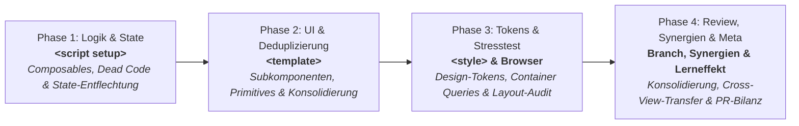

# View- & Komponenten-Refactoring Prompts

Diese Prompts dienen der systematischen Qualitätsprüfung und Überarbeitung überlanger oder historisch gewachsener Views und Komponenten in Reisotor (z. B. im Rahmen von Refactoring-Tickets wie #446).

Statt einer oberflächlichen Code-Verschiebung folgt die Überarbeitung dem **SFC-Schichten-Modell (von innen nach außen entlang der Vue-Natur: `<script>` → `<template>` → `<style>`)**:



> [!NOTE]
> **Projektweiter Pre-Release-Audit:** Für das ganzheitliche Testen der gesamten App vor Releases via paralleler Subagent-Teams siehe [`docs/UI_AUDIT_GUIDE.md`](UI_AUDIT_GUIDE.md#pre-release-gesamt-audit-orchestrierung--team-prompt).

---

## Kurz-Trigger für Sessions (Schnellstart)

Um in Agent-Sessions (Antigravity / Claude Code) für Refactoring-Tickets wie [#446](https://github.com/dmstern/reisotor/issues/446) nicht jedes Mal die langen Prompt-Blöcke kopieren zu müssen, reagieren Agenten auf folgende standardisierte Kurz-Trigger:

| Phase       | Kurz-Trigger                                                   | Fokus & Umfang                                                                                                                                      |
| :---------- | :------------------------------------------------------------- | :-------------------------------------------------------------------------------------------------------------------------------------------------- |
| **Phase 1** | `Refactor Phase 1: <datei>`                                    | Synergie-Katalog prüfen, `<script setup>` entflechten, Dead Code tilgen, Composables erstellen. Template & Styles bleiben unangetastet.             |
| **Phase 2** | `Refactor Phase 2: <datei>`                                    | Synergie-Katalog nutzen, `<template>` dekomponieren, Subkomponenten & Primitives nutzen, State & Assets lokalisieren.                               |
| **Phase 3** | `Refactor Phase 3: <datei>`                                    | `<style>` mit Design-Tokens säubern, `@media` restlos durch `@container` ersetzen & Layout-Audit.                                                   |
| **Phase 4** | `Refactor Phase 4: <datei>`<br/>_(`Refactor Review: <datei>`)_ | Ganzheitlicher Branch-Check (`git diff main`), Rest-Altlasten tilgen, Cross-View-Synergien erfassen & Katalog pflegen, PR-Bilanz & Meta-Refinement. |

> [!TIP]
> **Kontext-Disziplin & Session-Trennung:** Jede Phase baut auf dem sauberen Git-Stand der Vorphase auf und wird bevorzugt in einer **frischen Agent-Session / einem separaten Chat auf demselben Branch** ausgeführt (mit jeweils vorangehendem semantischem Commit). Dies verhindert Kontext-Drift, Token-Explosion und Error-Compounding, die bei unbeaufsichtigten Multi-Agent-Kaskaden auftreten würden.

_Beispiel-Eingabe im Chat:_

```text
Refactor Phase 1: frontend/src/views/ExcursionsView.vue
```

Sobald dieser Trigger fällt, zieht der Agent eigenständig die detaillierten Regeln und Prüfschritte der jeweiligen Phase heran.

---

## Phase 1: Logik- & State-Entflechtung (`<script setup>` & Composables)

Kopiere diesen Prompt für den ersten Schritt bei großen, historisch gewachsenen Komponenten.
**Ziel:** Den Script-Bereich massiv verschlanken, tote Altlasten eliminieren und saubere State-Schnittstellen schaffen. Das Template und die Styles bleiben in diesem Schritt im Wesentlichen unangetastet.

```text
Führe Phase 1 (Logik- & State-Entflechtung) für [KOMPONENTE / VIEW, z. B. frontend/src/views/SettingsView.vue] durch.
Ziel ist die Entflechtung des <script setup>-Bereichs, die Beseitigung von Altlasten und das Auslagern von Logik in fokussierte Composables.

1. Synergie-Harvesting vor Neuentwicklung (Wiederverwenden statt Klonen):
   - Konsultiere vor der Neuerstellung eigener Composables den "Cross-View-Synergien & Wiederverwendungs-Katalog" unten in docs/AUDIT_PROMPTS.md sowie frontend/src/composables/.
   - Prüfe, ob bereits existierende Composables (z. B. für Filterung, Formulare, Berechtigungen oder Modals) aus vorangegangenen Refactorings direkt wiederverwendet oder leicht generalisiert werden können, anstatt parallele Duplikate zu schaffen.

2. Entrümpelung & Dead-Code-Beseitigung:
   - Identifiziere und lösche unbenutzte Imports, verwaiste ref()s/computed()s, tote Hilfsfunktionen und auskommentierten Code.
   - Beseitige frühere Agenten-Workarounds, redundante Berechnungen oder doppelte State-Haltungen.

3. State & Fachlogik in Composables extrahieren:
   - Lagere zusammenhängende Geschäfts-, Berechnungs-, Filter- oder Sortierlogik in neue, fokussierte Composables unter frontend/src/composables/ (z. B. useSettingsForm.ts, useTripPermissions.ts) oder Pinia-Stores aus.
   - Vermeide riesige "Sammelbecken"-Composables: Schneide Logik gezielt nach fachlichen Domänen (z. B. useUserManagement.ts, usePushSettings.ts).
   - Formular- & Modal-State entkoppeln: Vermeide übergroße "Super-Form"-Composables, die Add- UND Edit-Logik samt Drafts in ein einziges 300+-Zeilen-Objekt stopfen. Trenne Formulare nach Verwendungszweck (z. B. useAddExpenseForm vs. useEditExpenseForm) oder bereite den State so vor, dass Modals ihren lokalen Form-Lifecycle in Phase 2 selbst instanziieren können, anstatt monströse State-Objekte durch die Haupt-View zu schleusen.
   - Definiere klare TypeScript-Interfaces für Optionen und Rückgabewerte.
   - Halte das <script setup> der Hauptkomponente schlank: Es dient nur noch der Orchestrierung und Bereitstellung der Daten.

4. Template & Styles intakt lassen (Verhinderung von Prop-Drilling-Spaghetti):
   - Zerlege in diesem Schritt noch KEIN Template in Kindkomponenten! Zuerst muss der State sauber sein, damit wir in Phase 2 wissen, welche Subkomponente welche Schnittstelle benötigt.
   - Ändere keine CSS-Klassen oder Styles.

5. Verifikation & Qualitätssicherung:
   - Führe npm run typecheck und betroffene Unit-Tests aus (Backend: npx -y vitest run <testdatei> --bail 1, Frontend: npm --prefix frontend test -- <testdatei> --bail 1).
   - Formatiere alle geänderten und neu erstellten Dateien (npx -y prettier --write <datei>).
   - Fasse transparent zusammen: Welche Composables wurden erstellt/wiederverwendet, wie viel Dead Code wurde gelöscht und um wie viele Zeilen ist das <script setup> geschrumpft?
   - Hinweis: Nach erfolgreichem Review folgt Phase 2 (UI-Dekomposition & Deduplizierung).
```

---

## Phase 2: UI-Dekomposition & Deduplizierung (`<template>`, Subkomponenten & Primitives)

Kopiere diesen Prompt für den zweiten Schritt, nachdem der State sauber in Composables entflochten ist.
**Ziel:** Das Template modularisieren, redundante UI-Muster zusammenführen und bestehende Design-System-Primitives einbinden.

```text
Führe Phase 2 (UI-Dekomposition & Deduplizierung) für [KOMPONENTE / VIEW, z. B. frontend/src/views/SettingsView.vue] durch.
Der Script-State ist bereits sauber entflochten. Nun wird das <template> modularisiert und auf Wiederverwendbarkeit getrimmt.

1. Synergie-Harvesting vor Neuentwicklung (Bestehendes nutzen):
   - Prüfe vor dem Schnitt neuer Subkomponenten den "Cross-View-Synergien & Wiederverwendungs-Katalog" unten in docs/AUDIT_PROMPTS.md sowie frontend/src/components/primitives/.
   - Wurden in vorangegangenen Refactorings anderer Views bereits passende Bausteine bereitgestellt (z. B. Listen-Toolbars, Filter-Pills, Accordions, Modal-Shells)? Binde sie direkt ein, statt lokale Doppelgänger zu bauen.

2. Deduplizierung & Konsolidierung (Gemeinsamkeiten vereinen statt klonen):
   - Analysiere wiederkehrende DOM-Muster im Template (z. B. ähnliche Cards, Listeneinträge, Filterleisten).
   - Führe ähnliche Abschnitte zu EINER flexiblen, wiederverwendbaren Subkomponente zusammen, statt blind 3 leicht unterschiedliche Varianten zu kopieren.

3. UI-Primitives sofort nutzen (components/primitives/):
   - Ersetze lokale HTML-Ad-hoc-Elemente (z. B. eigene <button class="btn...">, Badge-Pills oder Card-Container) direkt durch bestehende Primitives:
     Button, IconButton, Card, Badge, Input, DetailRow, EmptyState.
   - Falls ein neues UI-Element mehrfach nützlich ist: Als neues Primitiv unter frontend/src/components/primitives/ anlegen.

4. Subkomponenten & Dialoge schnüren:
   - Kapsele große Modals, Drawers oder eigenständige Abschnitte in neue Kindkomponenten unter frontend/src/components/...
   - Nutze saubere TypeScript defineProps<{...}>() und defineEmits<{...}>(). Da der State in Phase 1 modularisiert wurde, binde Subkomponenten entweder direkt an das passende Composable an oder übergebe minimale, fokussierte Props.
   - Vermeide monolithisches Prop-Drilling ganzer Composable-Return-Typen (z. B. props.form: ReturnType<typeof useForm>) und Destrukturierungen in <script setup>, die Reaktivität gefährden. Modals/Drawers mit isoliertem Formular-Lifecycle sollten ihr Composable bevorzugt direkt selbst instanziieren.
   - Konditionale Teleports & Docks: Werden UI-Elemente je nach Layout in externe Container verschoben (z. B. Schubladen oder Navigationsleisten), kapsele das konditionale Teleportieren in eine schlanke Hilfskomponente (z. B. DockTeleport mit <Teleport v-if="active" :to="to"><slot /></Teleport><slot v-else />), um doppelte Template-Bäume zu vermeiden.

5. Lokalisierung & Refinement von State und Assets:
   - Sobald Subkomponenten stehen: Prüfe, ob in Phase 1 erstellte Composables, Helper oder Icon-Definitionen, die ausschließlich in einer einzigen Subkomponente benötigt werden, direkt dorthin umgezogen oder feiner aufgeteilt werden können (z. B. tab-spezifische Reset-Logik direkt im Tab halten; Sektions-Icons direkt in der Subkomponente instanziieren statt im globalen Tab-Composable).
   - Bereinige historische CSS-Klassennamen aus Copy-Paste-Ursprüngen, damit sie zum neuen Kontext passen.

6. Verifikation & Qualitätssicherung:
   - Führe npm run typecheck und betroffene Tests aus.
   - Schreibe gezielte Unit-Tests (frontend/src/components/<Name>.test.ts) für neue, deduplizierte Kernkomponenten (insbesondere Toolbars, Formularfeld-Gruppen oder Dropdowns) und führe sie isoliert aus (npm --prefix frontend test -- <testdatei>).
   - Formatiere alle geänderten Dateien (npx -y prettier --write <datei>).
   - Fasse transparent zusammen: Welche Subkomponenten wurden extrahiert, welche Primitives wurden wiederverwendet und welche Redundanzen wurden eliminiert?
   - Hinweis: Nach erfolgreichem Review folgt Phase 3 (Design-Tokens & Layout-Härtung).
```

---

## Phase 3: Design-Tokens, Container-Queries & Layout-Härtung (`<style>` & Browser-Stresstest)

Kopiere diesen Prompt für den dritten Schritt, wenn Struktur und Komponenten stehen.
**Ziel:** CSS-Bereinigung mit Design-Tokens und visueller Härtung gegen Viewports und stufenlose Engezustände im echten Browser.

```text
Führe Phase 3 (Design-Tokens & Layout-Härtung) für [KOMPONENTE / VIEW, z. B. frontend/src/views/SettingsView.vue] durch.
Prüfe auf Einhaltung der Richtlinien aus DESIGN.md und führe einen Browser-Stresstest durch:

1. Design-Tokens & CSS-Bereinigung:
   - Keine freien Pixelwerte oder Ad-hoc-Farben: Ersetze lokale Werte konsequent durch --space-*, --font-size-*, --radius-* und --color-*-Tokens aus style.css.
   - Eckenrundungen (Squircle vs. Kreisbogen), Typografie und Schatten (--shadow-sm/--shadow-md) strikt gemäß DESIGN.md vereinheitlichen.
   - Additive Token-Ergänzungen in style.css: Fehlt für kleine UI-Elemente (z. B. Sub-Badges, Kalender-Pillen, Metatags) ein kleinerer Radius- oder Abstandswert im Design-System, darf dieser additiv in style.css ergänzt werden (z. B. --radius-xs: 6px; und --radius-xs-squircle inklusive Squircle-Feature-Query), anstatt unsaubere Ad-hoc-Pixelwerte im Komponenten-Style zu belassen.
   - Beseitige CSS-Hacks früherer Agenten (!important, negative Margins, willkürliche Z-Indizes) durch sauberes Flexbox/Grid.
   - Imperatives Third-Party-DOM (Leaflet, Mapbox, Canvas): Markup, das von externen Bibliotheken per JavaScript oder innerHTML erzeugt wird, erhält keine Scoped-CSS-Attribute (data-v-*). Kapsele solche Stile in einem separaten, ungescopten <style>-Block mit präzisen Selektoren und Begründungskommentar.

2. Container-Queries & Enge-Resilienz (Ersetzen statt Duplizieren):
   - Keine starren Pixelbreiten in Subkomponenten.
   - Ersetze bestehende @media-Breakpoints innerhalb von .app-main restlos durch @container app-main (max-width/min-width: ...) oder flexibles Flexbox-Wrapping (flex-wrap: wrap).
   - Keine redundanten @media-Blöcke parallel stehen lassen: Alte @media-Regeln müssen gelöscht werden, um CSS-Duplikate und unerwünschte Drawer-Effekte zu vermeiden.
   - Teleport-Kontext beachten: Teleportierte DOM-Knoten (z. B. in #map-focus-dock oder body) liegen außerhalb des lokalen @container-Geltungsbereichs ihrer Ursprungskomponente. Stelle sicher, dass ihre Styles kontextunabhängig greifen.

3. Adversarial Browser-Stresstest (Playwright):
  - Nutze die Vorlage unter e2e/tests/scratch/audit-template.spec.ts für die Route [z. B. /settings bzw. /trip/1/excursions].
  - 3-Viewport-Matrix: narrowMobile (320x568px), mobile (390x844px), desktop (1280x800px).
  - Enge-Matrix: Desktop mit maximal breit gezogener Schublade (setCalendarDrawerWidth(page, 500)) bzw. Spots-Spalte (setSpotsColumnWidth).
  - Checks: expectNoHorizontalOverflow(page), Touch-Targets auf Mobile (expectMinTouchTarget), lange Strings und expectNotCoveredBy().
  - Behebe gefundene Layout-Kollisionen direkt defensiv mit Tokens.
  - Scope-Disziplin: Härte primär die dekomponierten Subkomponenten und die View selbst. Externe, bereits eigenständige Komponenten nur anpassen, wenn der Stresstest auf der Route dort konkrete Kollisionen meldet.

4. Verifikation & Qualitätssicherung:
  - Führe npm run typecheck und AUDIT_ROUTE=<route> npm run test:audit aus.
  - Formatiere alle geänderten Dateien (npx -y prettier --write <datei>).
  - Binde Screenshots nur auf explizite Aufforderung in den Walkthrough ein.
  - Fasse transparent zusammen: Welche Tokens wurden vereinheitlicht und welche Layout-Kollisionen wurden behoben?
  - Hinweis: Nach erfolgreichem Abschluss folgt Phase 4 (Konsolidierung, Review & Meta-Refinement).
```

---

## Phase 4: Konsolidierung, Review & Meta-Refinement (Branch-Review, Synergien & Lerneffekte)

Kopiere diesen Prompt für den abschließenden Schritt nach Durchlauf der Phasen 1 bis 3 (oder nutze `Refactor Phase 4: <datei>` bzw. `Refactor Review: <datei>`).
**Ziel:** Ganzheitliche Konsolidierung aller Änderungen im Branch, Aufspüren von übrig gebliebenen Altlasten oder Redundanzen über alle Schichten hinweg, Erfassung von Cross-View-Synergien für künftige Sessions, Vorbereitung der finalen PR-Bilanz und die iterative Schärfung des Refactoring-Prozesses auf Meta-Ebene.

```text
Führe Phase 4 (Konsolidierung, Review & Meta-Refinement) für [KOMPONENTE / VIEW, z. B. frontend/src/views/SettingsView.vue] durch.
Alle drei Schichten (<script>, <template>, <style>) wurden in den Vorphasen überarbeitet. Nun erfolgt die ganzheitliche Konsolidierung, der Synergie-Transfer und der Meta-Review.

1. Branch-weites Diff- & Konsolidierungs-Review:
   - Analysiere das gesamte Diff des aktuellen Branches gegen main (git diff main...HEAD --stat).
   - Prüfe auf Rest-Altlasten über alle Phasen hinweg: Gibt es verwaiste Imports, ungenutzte Types/Interfaces, tote CSS-Klassen oder versehentlich stehen gelassene Debug-Logs/Kommentare?
   - Gezielter Altlasten-Scan: Suche nach temporären Unterstrich-Präfixen (z. B. `_store = useStore()`), die beim Auslagern in Phase 1 verwaist zurückblieben, sowie nach toten Selektoren aus früher durch Primitives ersetzten Ad-hoc-Elementen (z. B. `.info-dropdown` vs. `InfoPopover`).
   - Scoped-CSS & Subkomponenten-Audit: Prüfe, ob Selektoren, die Kindkomponenten-Elemente ansprechen, korrekte `:deep()`-Selektoren nutzen oder ob Klassen direkt per Prop/Attribute an die Subkomponente übergeben werden, damit Responsive-Regeln in Breakpoints zuverlässig greifen.
   - Konsistenz-Check: Wurden Composables und Subkomponenten einheitlich benannt und modular in den vorgesehenen Verzeichnissen (frontend/src/composables/, frontend/src/components/...) abgelegt?

2. Cross-View-Synergien & Wiederverwendungs-Transfer (Wissen an nächste Sessions weitergeben):
   - Synergie-Radar für Folge-Views: Analysiere die in diesem Durchlauf neu geschaffenen Composables und Subkomponenten: Welche davon enthalten universelle Muster, die auch in anderen noch zu überarbeitenden Views vorkommen (z. B. TodoView, ShoppingListView, PackingListView, ExcursionsView, BudgetView)?
   - Promotion-Check (Lokale Subkomponente → Primitiv / Shared): Eignet sich ein Baustein für mehr als diese eine View? Wenn ja: Verschiebe ihn direkt auf Primitiv- oder Shared-Ebene (frontend/src/components/primitives/ oder components/common/), statt ihn im lokalen View-Ordner zu isolieren, und statte ihn mit sauberen Props/Slots aus.
   - Synergie-Katalog pflegen: Trage neu bereitgestellte Bausteine und ihre potenziellen Ziel-Views direkt in den Abschnitt "Cross-View-Synergien & Wiederverwendungs-Katalog" unten in docs/AUDIT_PROMPTS.md ein, damit nachfolgende Sessions bei Phase 1 und 2 sofort darauf zugreifen können.

3. Finale Verifikation & CI-Readiness:
   - Führe npm run typecheck und die fokussierten Unit-Tests der neuen Subkomponenten/Composables aus (Backend: npx -y vitest run <testdatei> --bail 1, Frontend: npm --prefix frontend test -- <testdatei> --bail 1).
   - Stelle sicher, dass alle geänderten Dateien mit Prettier formatiert sind (npx -y prettier --write <dateien>).
   - Prüfe git status auf absolute Sauberkeit (keine ungetrackten Testdateien, Scratch-Specs oder temporäre Artefakte).

4. PR-Walkthrough & quantitative Bilanz:
   - Erstelle eine strukturierte Zusammenfassung für den PR:
     - Vorher/Nachher-Zeilenbilanz der Haupt-View / Komponente.
     - Liste neu entstandener Composables (inkl. fachlicher Domäne).
     - Liste neu entstandener Subkomponenten & genutzter Primitives.
     - Vereinheitlichte Design-Tokens und behobene Enge-/Layout-Probleme.
     - Identifizierte Cross-View-Synergien und aktualisierter Synergie-Katalog (welche Folge-Views profitieren davon?).

5. Meta-Evaluation des Refactoring-Workflows:
   - Reflektiere den Durchlauf: Gab es spezifische Hürden oder wiederkehrende Fallstricke (z. B. Reaktivitätsverlust beim Prop-Passing, Container-Query-Sonderfälle, unvollständige Mockups in Tests)?
   - Schärfe bei Bedarf direkt die Prompts in docs/AUDIT_PROMPTS.md oder die Design-Vorgaben in DESIGN.md additiv mit den neu gewonnenen Erkenntnissen nach, damit nachfolgende Refactorings automatisch davon profitieren.
```

---

## Cross-View-Synergien & Wiederverwendungs-Katalog

Dieser Katalog dient als **lebendes Gedächtnis zwischen separaten Agent-Sessions**. Wenn in einer View Komponenten oder Composables geschnitten werden, die auch für andere Views nützlich sind, werden sie hier registriert. Zu Beginn jedes neuen Refactorings (Phase 1 & 2) schlägt der Agent hier nach, um Doppelarbeit zu vermeiden.

### Bereits bereitgestellte & wiederverwendbare Bausteine

| Baustein              | Typ & Pfad                                                 | Herkunft          | Potenzielle Ziel-Views                                | Nutzen & Synergie-Potenzial                                                    |
| :-------------------- | :--------------------------------------------------------- | :---------------- | :---------------------------------------------------- | :----------------------------------------------------------------------------- |
| `DockTeleport`        | Primitiv (`components/primitives/DockTeleport.vue`)        | Settings / Layout | `ExcursionsView`, `BudgetView`, `ScheduleView`        | Konditionales Teleportieren in externe Docks/Drawer ohne Template-Duplikation. |
| `DoneToggle`          | Primitiv (`components/primitives/DoneToggle.vue`)          | Todo / Listen     | `ShoppingListView`, `PackingListView`, `ListenView`   | Einheitlicher Check- und Erledigt-Status mit Haptik/Animation.                 |
| `CollapsibleFieldset` | Primitiv (`components/primitives/CollapsibleFieldset.vue`) | Settings          | `BudgetView`, `ScheduleView`, `DiaryView`             | Einklappbare Formular- & Einstellungsabschnitte mit Pfeil-Indikator.           |
| `ColorSwatchPicker`   | Primitiv (`components/primitives/ColorSwatchPicker.vue`)   | Settings / Users  | `BudgetView` (Pots), `NotesView` (Tags), `ListenView` | Farbauswahl für Kategorien, Töpfe und Labels.                                  |
| `CheckableListItem`   | Primitiv (`components/primitives/CheckableListItem.vue`)   | Listen            | `TodoView`, `ShoppingListView`, `PackingListView`     | Standard-Listeneintrag mit Checkbox, Titel, Meta-Text und Action-Slot.         |

_(Wird bei jedem Phase-4-Durchlauf um neu geschnittene oder generalisierte Bausteine ergänzt)_

### Heuristik für den Promotion-Check (Wann gehört etwas in den Katalog?)

- **1x genutzt & sehr domänenspezifisch:** Bleibt lokale Subkomponente (z. B. `frontend/src/components/settings/SettingsSectionDanger.vue`).
- **In 2+ Views benötigt oder generisches UI-Muster:** Wird zu Primitiv (`frontend/src/components/primitives/`) oder Shared-Komponente (`frontend/src/components/common/`) befördert, hier im Katalog eingetragen und im PR erwähnt.
- **Wiederkehrende State-Logik (Filter, Suche, Form-Drafts, Paging):** Wird als generisches Composable unter `frontend/src/composables/` angelegt und hier für andere Listen/Views annotiert.
