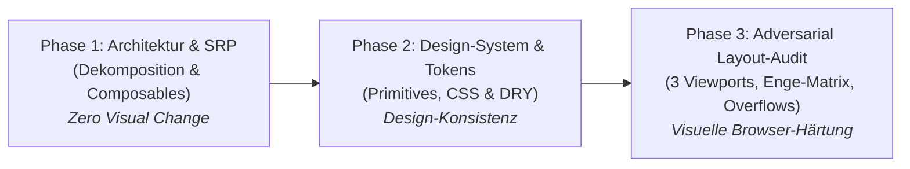

# View- & Komponenten-Refactoring Prompts

Diese Prompts dienen der systematischen Qualitätsprüfung und Überarbeitung einzelner Views oder großer Komponenten in Reisotor (z. B. im Rahmen von Refactoring-Tickets wie #446).
Der empfohlene Ablauf pro View folgt dem Prinzip: **Erst Architektur & Struktur refactorn (Zero Visual Change), dann Design-System & Tokens vereinheitlichen, dann das Layout im Browser stress-testen.**



> [!NOTE]
> **Projektweiter Pre-Release-Audit:** Für das ganzheitliche Testen der gesamten App vor Releases via paralleler Subagent-Teams siehe [`docs/UI_AUDIT_GUIDE.md`](UI_AUDIT_GUIDE.md#pre-release-gesamt-audit-orchestrierung--team-prompt).

---

## Phase 1: Architektur- & SRP-Refactoring (Dekomposition & Composables)

Kopiere diesen Prompt für den ersten Schritt bei großen oder monolithischen Komponenten (> 300–400 Zeilen).
**Wichtig:** Dieser Schritt ist **strikt verhaltens- und stylingneutral** (_Zero Visual Change_). Keine CSS-Klassen, Abstände oder Layout-Tokens anfassen!

```text
Führe ein reines Architektur- und Struktur-Refactoring für [KOMPONENTE / VIEW, z. B. frontend/src/views/SettingsView.vue] durch.
Ziel ist maximale Wartbarkeit und Modularisierung nach Single Responsibility Principle (SRP) und Separation of Concerns (SoC) – STRENG UNTER DEM PRINZIP: ZERO VISUAL CHANGE.

1. Dekomposition (SRP):
   - Prüfe die Dateigröße. Zerschneide monolithische Abschnitte (> 300–400 Zeilen) in fokussierte, dedizierte Unterkomponenten (z. B. Modals, Drawers, Filterleisten, Card-Items).
   - Kapsele zusammengehörige Template-Abschnitte und deren lokales Styling in neue Kindkomponenten unter frontend/src/components/...
   - Typisiere Props und Emits sauber (defineProps<{...}>(), defineEmits<{...}>()).

2. Separation of Concerns (SoC & Composables):
   - Extrahiere reine Geschäfts-, Berechnungs-, Filter- oder Sortierlogik aus dem <script setup> in fokussierte Composables (unter frontend/src/composables/useXxx.ts) oder Pinia-Stores.
   - Halte den Script-Teil der View schlank (nur Orchestrierung, State-Verdrahtung und Template-Anbindung).

3. Striktes Refactoring-Prinzip (Keine optischen Änderungen):
   - Ändere KEINE Styles, CSS-Klassen, Abstände, Farben oder Tokens.
   - Ersetze KEINE UI-Elemente durch Primitives (dies erfolgt separat in Phase 2).
   - Das gerenderte DOM und das optische Verhalten im Browser müssen 1:1 identisch bleiben.

4. Verifikation & Qualitätssicherung:
   - Führe npm run typecheck und betroffene Unit-Tests aus (npx -y vitest run <testdatei> --bail 1).
   - Formatiere alle geänderten und neu erstellten Dateien (npx -y prettier --write <datei>).
   - Fasse transparent zusammen: Welche Unterkomponenten und Composables wurden extrahiert und um wie viele Zeilen wurde die Originaldatei reduziert?
   - Hinweis: Nach erfolgreichem Review/Merge folgt Phase 2 (Design-System & Tokens).
```

---

## Phase 2: Design-System- & Token-Refactoring (Primitives & Styling)

Kopiere diesen Prompt für den zweiten Schritt, nachdem die Komponente strukturell in handhabbare Teilkomponenten zerlegt ist. Hier werden CSS-Redundanzen beseitigt und das Design-System vereinheitlicht:

```text
Führe ein Design-System- und UI-Konsistenz-Refactoring für [KOMPONENTE / VIEW, z. B. frontend/src/views/SettingsView.vue] (inkl. aller zugehörigen Teilkomponenten) durch.
Prüfe gnadenlos auf Einhaltung der Richtlinien aus DESIGN.md und AGENTS.md:

1. Design-Tokens & CSS-Bereinigung:
   - Keine freien Pixelwerte oder Ad-hoc-Farben: Ersetze lokale Werte konsequent durch --space-*, --text-*, --radius-* und --color-*-Tokens aus style.css.
   - Eckenrundungen (Squircle vs. Kreisbogen), Typografie und Schatten (--shadow-sm/--shadow-md) strikt gemäß DESIGN.md vereinheitlichen.
   - Redundante CSS-Kopien zwischen Kindkomponenten eliminieren.

2. UI-Primitives wiederverwenden:
   - Prüfe, wo bestehende Primitives (Button, IconButton, Card, Input, Badge, DetailRow, EmptyState unter frontend/src/components/primitives/) wiederverwendet werden müssen, statt lokale Buttons/Karten im Template nachzubauen.
   - Falls ein neues UI-Element sinnvoll und mehrfach nützlich ist: Als neues Primitiv unter frontend/src/components/primitives/ kapseln.

3. Enge-Resilienz & Container-Queries:
   - Verwende keine starren Pixelbreiten in Subkomponenten.
   - Nutze @container app-main (min-width: ...) oder flexibles Flexbox-Wrapping (flex-wrap: wrap) statt starrer Pixel-Breakpoints oder @media.

4. Verifikation & Qualitätssicherung:
   - Führe npm run typecheck und betroffene Unit-Tests aus (npx -y vitest run <testdatei> --bail 1).
   - Formatiere alle geänderten Dateien (npx -y prettier --write <datei>).
   - Fasse transparent zusammen: Welche Tokens wurden vereinheitlicht, welche Primitives eingebaut und welches CSS eliminiert?
   - Hinweis: Nach erfolgreichem Review/Merge folgt Phase 3 (Gezielter Layout- & Adversarial-Audit).
```

---

## Phase 3: Gezielter Layout- & Adversarial-Audit (Browser-Stresstest)

Kopiere diesen Prompt, wenn die Code-Basis und das Styling einer View stehen und du das visuelle Layout im Browser stress-testen willst:

```text
Führe einen gezielten Adversarial-UI-Audit für [VIEWNAME, z. B. SettingsView / ExcursionsView] durch:
1. Nutze die Vorlage unter e2e/tests/scratch/audit-template.spec.ts für die Route [z. B. /settings bzw. /trip/1/excursions].
2. Teste die Viewport- & Drawer-Matrix:
   - narrowMobile (320x568px, iPhone SE) & mobile (390x844px) auf expectNoHorizontalOverflow(page)
   - narrowDesktop (1080x900px) & desktop (1280x800px) jeweils mit geschlossener, normal geöffneter UND maximal breit gezogener Schublade (setCalendarDrawerWidth(page, 500))
   - Bei Excursions/Spots: Prüfe zusätzlich stufenlose Verstellung der Spots-Spalte (setSpotsColumnWidth)
3. Stresse die UI gezielt:
   - Öffne Modals / Dropdowns und prüfe expectNotCoveredBy() bzw. ob Menüs abgeschnitten werden.
   - Teste mit langen Strings (Zeilenumbrüche / Text-Overflow) und leeren Zuständen (Empty States).
   - Prüfe Touch-Targets auf Mobile mit expectMinTouchTarget().
4. Binde Screenshots der repräsentativen Zustände (Mobile + Desktop, hell/dunkel) in den Walkthrough ein (nur auf explizite Nutzer-Aufforderung) und berichte gefundene Layout-Kollisionen.
   - Falls du gefundene Layout-Kollisionen direkt behebst: Halte dich strikt an DESIGN.md (ausschließlich --space-* und --color-*-Tokens, keine Ad-hoc-Pixelwerte oder improvisierte Inline-Styles).
   - WICHTIG: Führe im Rahmen dieses Layout-Audits KEIN eigenmächtiges Groß-Refactoring an der Komponentenstruktur durch – führe für architektonisches Aufräumen stattdessen vorab Phase 1 und Phase 2 durch.
```
